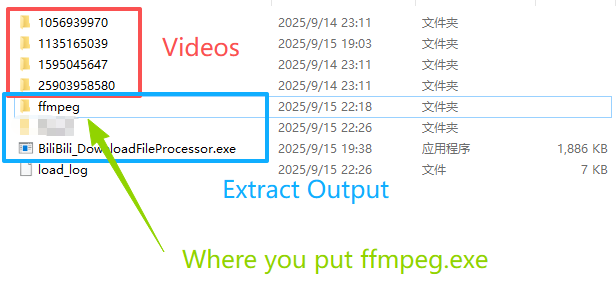

# BiliBili_DownloadFileProcessor
A naive app to process download files from BiliBili app and turns them into available mp4 or mp3 automatically.

## Features
- Automatically scans and processes BiliBili app download folders
- Converts .m4s files to .mp4
- Extracts audio and converts .mp4 to .mp3 using FFmpeg
- Results are named by its video title
- Supports Chinese filenames
- Simple command-line interface

## Dependencies
- [FFmpeg](https://ffmpeg.org/) (for media conversion)
- [nlohmann/json](https://github.com/nlohmann/json) (for JSON parsing)
- C++17 or later
- CMake 3.10 or later
> Only Windows is supported currently, older versions of dependencies might work but are not tested.

## Installation & Build
1. Clone this repository.
   > **nlohmann/json** is header-only and already included in the `include` folder.
   > **FFmpeg** is not included due to its size. Please download `ffmpeg.exe` manually (see the link above) and place it in the `ffmpeg` directory. Alternatively, you can run the provided `download_ffmpeg.bat` script to fetch it automatically.

   Or, if you prefer:
   > Download the release package from the `release` section of this repository. All required files are included—no need to build, so you can skip step 2 below. Simply extract everything to your Bilibili download folder. For details, see the **Usage** section below.

2. Build with CMake:
   ```sh
   mkdir build
   cd build
   cmake ..
   cmake --build .
   ```
   > If you already have FFmpeg installed, just copy `ffmpeg.exe` (and any required .dll files) to the `ffmpeg` directory. For details, see the **Usage** section below.

## Usage
I strongly recommend you to see the video tutorial first: [video tutorial](https://www.example.com)

1. Place the executable `BiliBili_DownloadFileProcessor.exe` and the folder `ffmpeg` to **the Bilibili download directory**. Please ensure the `ffmpeg` folder contains `ffmpeg.exe`, and don't forget any required .dll files if there are any.
2. Run the executable file **BiliBili_DownloadFileProcessor.exe**, it will automatically process all relevant files in the directory. (**ffmpeg.exe** is dependence, must be in the same directory and don't run it.)
3. Processed mp4 and mp3 files will be output to the `Result` directory. (If the directory doesn't exist, it will be created automatically.)

Here is an example of the folder structure after placing the executable and `ffmpeg` folder:
```
[**video offline download folder**]
├── some_video_folder/something
├── BiliBili_DownloadFileProcessor.exe
└── ffmpeg/
    ├── ffmpeg.exe
    └── (any required .dll files if there are any)
```

## Example Screenshot


## Directory Structure
```
BiliBili_DownloadFileProcessor/
├── include/         # Header files
├── src/             # Source files
├── bin/             # The executables will be generated here
├── CMakeLists.txt   # Build configuration
├── README.md        # Project documentation
```

## License
- This project uses [FFmpeg](https://ffmpeg.org/) (GPL-3.0 License).
- It also uses [nlohmann/json](https://github.com/nlohmann/json) (MIT License).
- All other source code in this repository is licensed under the MIT License unless otherwise specified.

## Acknowledgements
- [FFmpeg](https://ffmpeg.org/)
- [nlohmann/json](https://github.com/nlohmann/json)

## Contact
For questions or suggestions, please open an issue on GitHub.

## Todo
- If there is no ffmpeg.exe found, the program should display an error message and exit gracefully.
